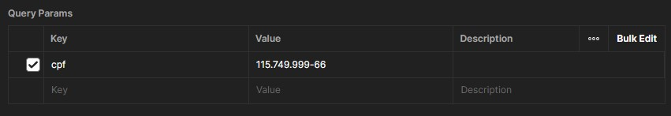
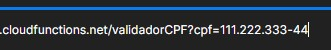

# **Valida CPF**

### Essa função **lambda** verifica se o **CPF** possui um formato válido e se os dígitos verificadores estão corretos. No entanto, essa validação não garante a existência real do **CPF** em uma base de dados oficial.

---

## **Como utilizar**

- 1.  Primeiro precisa fazer um Request na rota da **API** com o Postman ou outro software.
- 2. Para poder fazer uma requição e envia o CPF como paramêtro irei utilizar o **Params** do Postman

**OBS**: O valor do CPF deve ser enviado com os caractéres do CPF ex: 111.222.333-44

- 3. Você poderá ver que vai ficará assim na URL:

- 4. Esse aqui será o retorno quando a requisição for executada:

